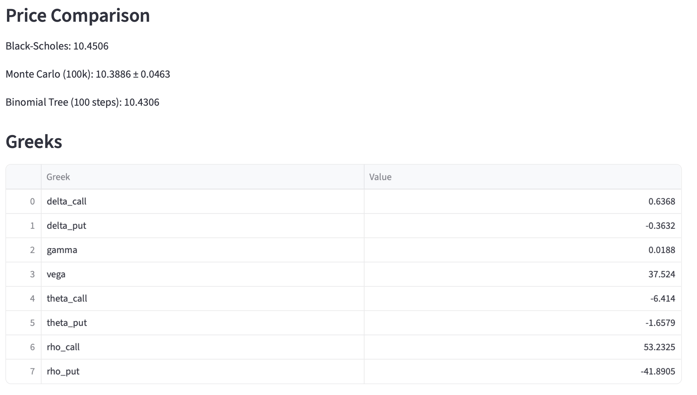
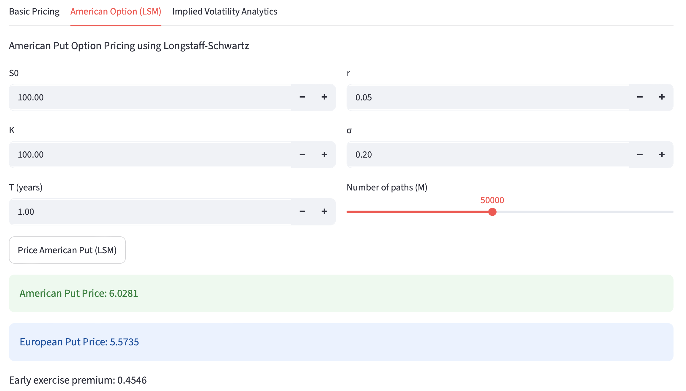
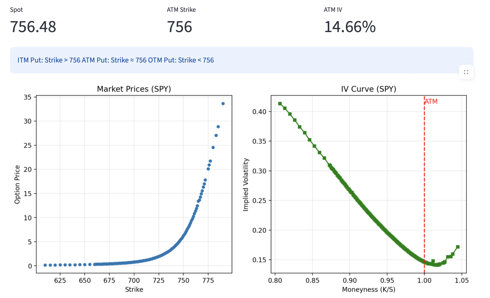

# Option Pricing and Volatility Analytics Toolbox

A quantitative finance project that combines analytical pricing models, numerical methods, option risk analysis, and real-market implied volatility analytics in a single interactive application.

The toolkit implements multiple option pricing models, including **Black-Scholes**, **Monte Carlo Simulation**, **Cox-Ross-Rubinstein (CRR) Binomial Tree**, and **Longstaff-Schwartz Least Squares Monte Carlo (LSM)** for American options. It also retrieves live option chain data from Yahoo Finance to compute implied volatility and visualize volatility smiles and volatility skews across equities, ETFs, indices, FX pairs, and cryptocurrencies.

Built with **Streamlit**, the application provides an interactive environment for exploring option pricing theory, comparing pricing methodologies, analyzing option Greeks, and studying market-implied volatility.

## Features

### Greeks Calculation

Compute first- and second-order option sensitivities:

* Delta
* Gamma
* Vega
* Theta
* Rho

### Implied Volatility Analytics

* Retrieve live option chain data from Yahoo Finance
* Calculate implied volatility via numerical inversion of Black-Scholes
* Visualize volatility smiles and volatility skews
* Analyze ATM, ITM, and OTM options
* Support equities, ETFs, indices, FX pairs, and cryptocurrencies

### Interactive Dashboard

* Adjust model parameters in real time
* Compare pricing outputs across models
* Explore sensitivity to volatility, interest rates, and maturity

## Methodology

### Black-Scholes Model

Provides a closed-form solution for European option pricing under the assumption of constant volatility and lognormally distributed stock prices.

### Monte Carlo Simulation

Simulates thousands of stock price paths under risk-neutral dynamics and estimates option value from discounted expected payoffs.

### CRR Binomial Tree

Constructs a recombining price lattice and evaluates option values through backward induction. The framework naturally accommodates early exercise decisions for American-style options.

### LSM

Uses least-squares regression to estimate continuation values from simulated price paths, enabling efficient pricing of American options with early exercise features.

### Implied Volatility Estimation

Market-implied volatility is obtained by numerically inverting the Black-Scholes pricing formula using observed option prices. The resulting implied volatility curve is used to study volatility smiles and volatility skews observed in real markets.

## Usage

1. Clone the repository
2. Create a virtual environment
```bash
python -m venv venv
```
3. activate the virtual environment

**Windows**
```bash
venv\Scripts\activate
```
**macOS / Linux**
```bash
source venv/bin/activate
```
3. Install dependencies
```bash
pip install -r requirements.txt
```
4. Launch the Streamlit application:
```bash
streamlit run app.py
```

## Sample Results

Example outputs include:

### European Option Pricing Comparison



### American Put Pricing with LSM



### Market Implied Volatility Analytics



## Future Improvements

* Finite-difference methods for option pricing
* Heston stochastic volatility model
* Volatility surface visualization
* Historical backtesting of volatility dynamics

## Educational Purpose

This project was developed to explore numerical methods in quantitative finance and financial engineering. It combines analytical models, simulation-based approaches, and real market data to provide a practical framework for studying option pricing and risk management.
